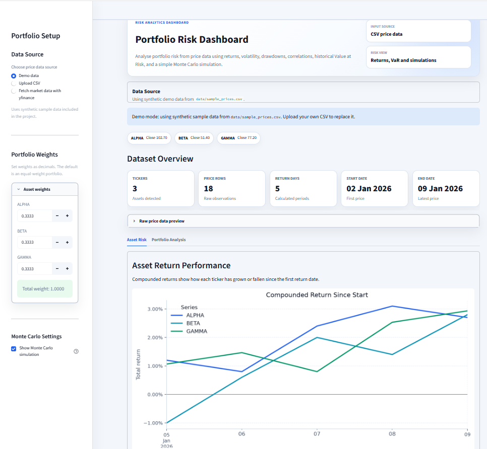
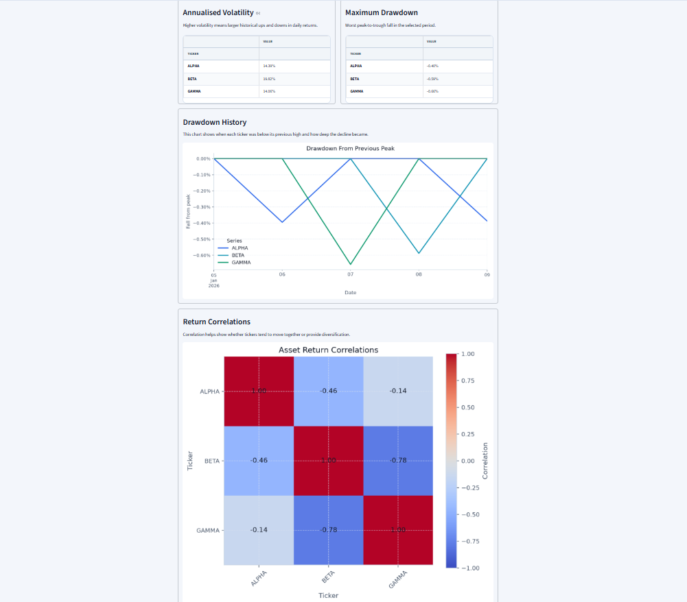
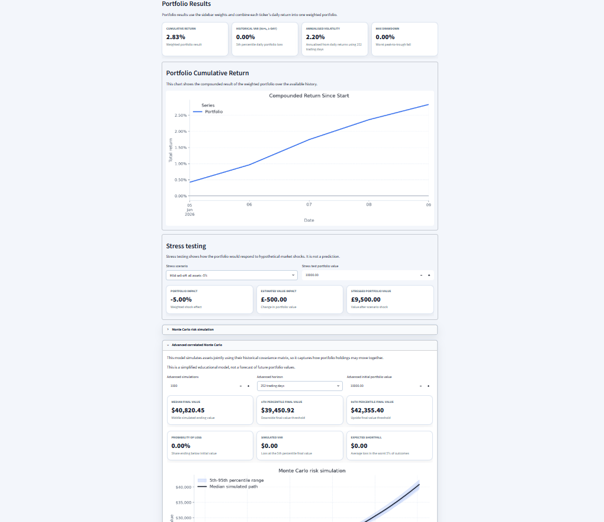
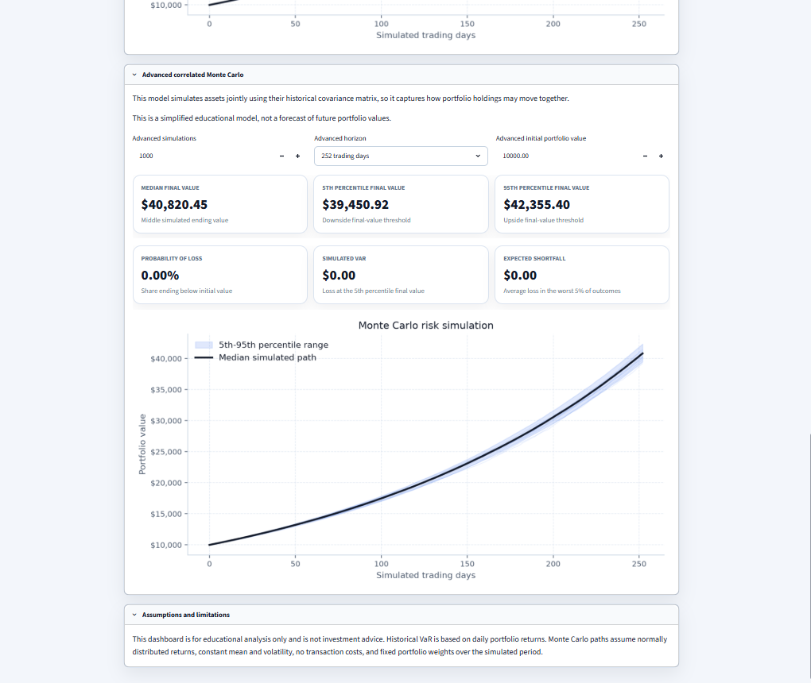

# Portfolio Risk Dashboard

A Streamlit dashboard for exploring portfolio risk from price data. The project focuses on clear, testable Python calculations for returns, volatility, drawdowns, Value at Risk, stress testing and Monte Carlo simulation.

I built this as a student portfolio project to practise applying data analysis and engineering-style modelling to finance and risk analytics.

## Dashboard Preview

**Dashboard overview**


**Asset risk tab**


**Portfolio analysis tab**


**Correlated Monte Carlo simulation**


## Features

- Load demo data, upload a CSV, or fetch optional yfinance data
- Calculate daily and cumulative returns
- Measure annualised volatility
- Analyse drawdowns and maximum drawdown
- View return correlations between assets
- Set custom portfolio weights
- Calculate historical 95% one-day Value at Risk
- Run scenario stress tests
- Run a basic portfolio-level Monte Carlo simulation
- Run a correlated asset-level Monte Carlo simulation using historical covariance
- Summarise simulated VaR, Expected Shortfall / CVaR and probability of loss

## Tech Stack

- Python
- pandas
- NumPy
- matplotlib
- Streamlit
- pytest

## Project Structure

```text
app.py                  Streamlit dashboard UI
src/                    Calculation, chart and UI helper modules
tests/                  pytest tests for the calculation logic
data/sample_prices.csv  Synthetic demo price data
assets/                 README screenshots
```

The calculation logic is kept separate from the Streamlit app so the finance functions can be tested directly.

## Risk Metrics

**Returns** measure price changes over time. Cumulative returns are compounded rather than summed.

**Volatility** measures how much returns vary. The dashboard annualises daily volatility using 252 trading days.

**Drawdown** measures the fall from a previous peak. Maximum drawdown is the worst peak-to-trough decline in the selected period.

**Correlation** is calculated on returns, not prices, to show how assets have moved together historically.

**Historical VaR** uses the lower tail of historical portfolio returns and reports the result as a positive loss.

**Stress testing** applies user-defined or preset shocks to each holding. Shocks are handled as decimal returns in the calculation layer.

**Monte Carlo simulation** is included as a simplified risk illustration, not a forecast. The correlated version simulates assets jointly using their historical covariance matrix.

## Run Locally

```powershell
python -m venv .venv
.\.venv\Scripts\Activate.ps1
python -m pip install -r requirements.txt
.\.venv\Scripts\streamlit.exe run app.py
```

Then open the local Streamlit URL shown in the terminal.

## CSV Format

Custom CSV files should contain:

```text
Date,Ticker,Close
```

Example:

```text
Date,Ticker,Close
2026-01-02,AAPL,185.64
2026-01-02,MSFT,412.21
```

## Tests

Run the test suite with:

```powershell
.\.venv\Scripts\pytest.exe tests
```

The tests include hand-calculated examples for the main finance calculations.

## Limitations

- The demo data is synthetic.
- yfinance data is optional and may be delayed or unavailable.
- The risk models are simplified for learning and portfolio-project purposes.
- Historical data and simulations do not predict future returns.
- This project is not investment advice.

## Future Improvements

- Add exportable reports
- Add more portfolio optimisation tools
- Add factor exposure analysis
- Deploy the dashboard online
